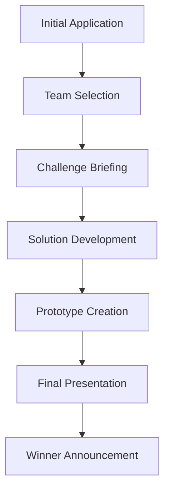

# Porsche Digital Campus Challenge 2025 Final Winner

A prestigious achievement representing Germany in the global Porsche Digital Campus Challenge.

## Achievement Overview

The Porsche Digital Campus Challenge 2025 was a global competition that brought together the brightest minds from universities worldwide to tackle real-world challenges in digital transformation and automotive innovation.

## Competition Details

### Challenge Category: Brand Experience
- **Participants**: 196 teams from universities worldwide
- **Representation**: German representative team
- **Final Result**: 1st Place Winner
- **Focus Area**: Digital brand experience and customer journey optimization

### Key Accomplishments

1. **Strategic Innovation**: Developed a comprehensive digital brand experience strategy
2. **Technical Implementation**: Created prototype solutions for customer engagement
3. **International Recognition**: Achieved top ranking among global participants
4. **Leadership Excellence**: Led cross-functional team collaboration

## Skills Demonstrated

### Innovation & Strategy
- Creative problem-solving approaches
- Strategic thinking and planning
- Future-oriented solution design

### Digital Transformation
- Customer experience optimization
- Digital touchpoint integration
- Technology adoption strategies

### Technology Leadership
- Team coordination and management
- Technical project execution
- Stakeholder communication

## Competition Journey

The competition consisted of multiple phases:

### Phase 1: Team Formation and Selection
- University-level competition for team selection
- Multi-disciplinary team assembly
- Initial concept validation

### Phase 2: Challenge Deep Dive
- Comprehensive brief analysis
- Market research and user insights
- Technical feasibility assessment

### Phase 3: Solution Development
- Iterative design and development process
- Prototype creation and testing
- Stakeholder feedback integration

### Phase 4: Final Presentation
- Pitch development and rehearsal
- Live presentation to Porsche Digital executives
- Q&A session with industry experts

## Impact and Recognition

This achievement represents:
- **Excellence in Innovation**: Top-tier creative and technical capabilities
- **International Competitiveness**: Ability to compete at the highest global level
- **Industry Recognition**: Acknowledgment from Porsche Digital leadership
- **Future Leadership Potential**: Demonstrated capacity for driving digital transformation

## Future Applications

The skills and experience gained from this competition are directly applicable to:
- Digital transformation initiatives
- Customer experience optimization projects
- Innovation management roles
- Technology leadership positions
- Strategic consulting opportunities
