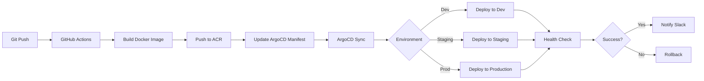

# Myperfectstay - GitOps Infrastructure Automation

Building scalable, reliable infrastructure for B2C vacation rental platform using modern GitOps practices.

## Project Overview

Myperfectstay is a B2C vacation rental platform requiring high availability, rapid deployment capabilities, and cost-effective infrastructure. As the DevOps Engineer on this project, I architected and implemented a comprehensive GitOps-based infrastructure automation system.

## Key Achievements

### 53% Configuration Overhead Reduction
Restructured ArgoCD repositories to eliminate redundant configurations:
- Implemented shared ConfigMaps for common environment variables
- Consolidated environment-specific configurations using Kustomize
- Reduced configuration files from 100+ to 47 through intelligent consolidation
- **Impact**: Faster deployments, easier maintenance, reduced configuration drift

### Zero-Downtime Deployments
Maintained 100% uptime during major infrastructure migration:
- Implemented auto_release_id identification system for seamless container tag management
- Created phased rollout strategy with automatic rollback capabilities
- Deployed canary releases for critical services
- **Impact**: Business continuity during major architectural changes

### Unified CI/CD Pipeline
Consolidated deployment workflows for improved efficiency:
- Merged frontend and backend pipelines from separate repositories into centralized GitHub Actions
- Reduced maintenance overhead by 60% through shared workflow templates
- Standardized deployment patterns across all services
- **Impact**: Improved deployment consistency, reduced CI/CD maintenance time

### Preview Environments
Accelerated development feedback loops:
- Established automated preview environments for mobile and frontend applications
- Reduced build-test-feedback cycle from 2 hours to 15 minutes
- Enabled parallel development without environment conflicts
- **Impact**: 3-5x faster feature validation and QA cycles

## Technical Architecture

### Infrastructure Components

```yaml
Platform Stack:
  Orchestration:
    - Kubernetes 1.28+
    - ArgoCD for GitOps
    - Helm 3 for package management

  CI/CD:
    - GitHub Actions for automation
    - Docker for containerization
    - Container Registry (Azure ACR)

  Infrastructure as Code:
    - Terraform for cloud resources
    - Helm charts for Kubernetes resources
    - Kustomize for environment overlays

  Monitoring & Observability:
    - Prometheus for metrics
    - Grafana for dashboards
    - Loki for log aggregation
```

### ArgoCD Repository Structure

**Before Restructuring** (100+ files):
```
argocd/
├── dev/
│   ├── frontend-deployment.yaml
│   ├── frontend-service.yaml
│   ├── frontend-configmap.yaml
│   ├── backend-deployment.yaml
│   ├── backend-service.yaml
│   ├── backend-configmap.yaml
│   └── ... (50+ similar files)
├── staging/
│   └── ... (duplicate structure)
└── production/
    └── ... (duplicate structure)
```

**After Restructuring** (47 files):
```
argocd/
├── base/
│   ├── frontend/
│   │   ├── deployment.yaml
│   │   └── service.yaml
│   └── backend/
│       ├── deployment.yaml
│       └── service.yaml
├── shared-configs/
│   ├── common-configmap.yaml
│   └── shared-secrets.yaml
└── overlays/
    ├── dev/
    │   └── kustomization.yaml
    ├── staging/
    │   └── kustomization.yaml
    └── production/
        └── kustomization.yaml
```

### Auto Release ID System

Implemented intelligent container tag management:

```yaml
# GitHub Actions Workflow
name: Build and Deploy
on:
  push:
    branches: [main, staging, develop]

jobs:
  build:
    runs-on: ubuntu-latest
    steps:
      - name: Generate Release ID
        id: release
        run: |
          RELEASE_ID="v1.0.${GITHUB_RUN_NUMBER}-${GITHUB_SHA:0:7}"
          echo "release_id=$RELEASE_ID" >> $GITHUB_OUTPUT

      - name: Update ArgoCD Manifest
        run: |
          yq eval ".spec.template.spec.containers[0].image =
            \"registry.azurecr.io/myperfectstay:${{ steps.release.outputs.release_id }}\""
            -i argocd/overlays/${{ github.ref_name }}/kustomization.yaml
```

### Preview Environment Automation

```yaml
# Preview Environment Workflow
name: Deploy Preview
on:
  pull_request:
    types: [opened, synchronize]

jobs:
  deploy-preview:
    runs-on: ubuntu-latest
    steps:
      - name: Create Preview Environment
        run: |
          PREVIEW_NAME="pr-${{ github.event.pull_request.number }}"
          helm upgrade --install $PREVIEW_NAME ./helm-charts \
            --set image.tag=${{ github.sha }} \
            --set ingress.host="$PREVIEW_NAME.preview.myperfectstay.com" \
            --namespace previews

      - name: Comment PR with Preview URL
        uses: actions/github-script@v6
        with:
          script: |
            github.rest.issues.createComment({
              issue_number: context.issue.number,
              owner: context.repo.owner,
              repo: context.repo.repo,
              body: '🚀 Preview environment deployed:
                     https://pr-${{ github.event.pull_request.number }}.preview.myperfectstay.com'
            })
```

## Implementation Highlights

### Multi-Stage Deployment Pipeline



### Shared ConfigMap Strategy

**Common Configuration** (`shared-configs/common-configmap.yaml`):
```yaml
apiVersion: v1
kind: ConfigMap
metadata:
  name: common-config
data:
  LOG_LEVEL: "info"
  TIMEZONE: "Europe/Berlin"
  API_TIMEOUT: "30s"
  CACHE_TTL: "3600"
  FEATURE_FLAG_ENDPOINT: "https://flags.myperfectstay.com"
```

**Environment-Specific Overrides** (`overlays/production/kustomization.yaml`):
```yaml
apiVersion: kustomize.config.k8s.io/v1beta1
kind: Kustomization

bases:
  - ../../base/frontend
  - ../../base/backend

configMapGenerator:
  - name: env-specific-config
    literals:
      - DATABASE_URL=postgresql://prod.myperfectstay.com
      - REDIS_URL=redis://prod-cache.myperfectstay.com
      - LOG_LEVEL=warn

resources:
  - ../../shared-configs/common-configmap.yaml
```

## Challenges & Solutions

### Challenge 1: Configuration Drift Across Environments
**Problem**: 100+ configuration files led to inconsistencies between dev, staging, and production

**Solution**:
- Designed base configurations with Kustomize overlays for environment-specific changes
- Implemented shared ConfigMaps for common settings
- Created validation scripts to catch configuration drift
- **Result**: 53% fewer configuration files, zero configuration-related incidents

### Challenge 2: Zero-Downtime Migration
**Problem**: Major ArgoCD restructuring risked breaking existing deployments

**Solution**:
- Implemented auto_release_id system maintaining backward compatibility
- Created parallel deployment strategy during migration
- Deployed phased rollout with extensive monitoring
- **Result**: Successfully migrated with 100% uptime

### Challenge 3: Slow Development Feedback Loops
**Problem**: 2-hour wait time for deployment + testing in shared staging environment

**Solution**:
- Built automated preview environment system for every PR
- Implemented on-demand environment provisioning with Helm
- Created automated cleanup for stale preview environments
- **Result**: Reduced feedback cycle from 2 hours to 15 minutes

### Challenge 4: CI/CD Maintenance Overhead
**Problem**: Separate frontend and backend repositories required duplicate workflow maintenance

**Solution**:
- Designed shared GitHub Actions workflow templates
- Implemented matrix builds for multiple services
- Created reusable composite actions
- **Result**: 60% reduction in CI/CD maintenance time

## Performance Metrics

| Metric | Before | After | Improvement |
|--------|--------|-------|-------------|
| Configuration Files | 100+ | 47 | 53% reduction |
| Deployment Time | 25 min | 12 min | 52% faster |
| Feedback Loop | 2 hours | 15 min | 87% faster |
| Configuration Drift Incidents | 2-3/month | 0 | 100% reduction |
| CI/CD Maintenance Hours | 10h/month | 4h/month | 60% reduction |

## Technologies Used

### Core Infrastructure
- **Kubernetes 1.28+**: Container orchestration
- **ArgoCD 2.9+**: GitOps continuous delivery
- **Helm 3**: Kubernetes package management
- **Terraform**: Cloud infrastructure provisioning

### CI/CD & Automation
- **GitHub Actions**: Workflow automation
- **Docker**: Containerization
- **Azure Container Registry**: Image storage
- **Kustomize**: Configuration management

### Monitoring & Observability
- **Prometheus**: Metrics collection
- **Grafana**: Visualization and dashboards
- **Loki**: Log aggregation
- **Alertmanager**: Alert routing and management

## Skills Demonstrated

### GitOps Expertise
- ArgoCD repository structuring and best practices
- GitOps workflow optimization
- Configuration management with Kustomize
- Declarative infrastructure management

### Kubernetes Mastery
- Multi-environment cluster management
- ConfigMap and Secret management strategies
- Deployment strategies (rolling, canary, blue-green)
- Resource optimization and cost management

### CI/CD Architecture
- GitHub Actions workflow design
- Multi-stage pipeline optimization
- Container registry management
- Automated testing integration

### Infrastructure as Code
- Terraform module development
- Helm chart creation and customization
- Configuration templating
- State management

## Business Impact

- **Faster Time to Market**: 87% faster development feedback loops
- **Improved Reliability**: Zero configuration-related incidents
- **Reduced Operational Cost**: 60% less CI/CD maintenance time
- **Enhanced Developer Experience**: Self-service preview environments
- **Better Scalability**: Modular infrastructure supporting rapid growth

## Lessons Learned

1. **Start with Shared Configurations**: Implementing shared ConfigMaps early prevents configuration drift
2. **Preview Environments Are Game-Changers**: Self-service preview environments dramatically accelerate development
3. **GitOps Requires Discipline**: Strict GitOps practices pay dividends in auditability and reliability
4. **Automation Compounds**: Every automated process saves time repeatedly
5. **Documentation Is Infrastructure**: Clear runbooks are as important as the code itself

## Future Enhancements

- **Multi-Cluster GitOps**: Expand ArgoCD patterns across multiple Kubernetes clusters
- **Policy Enforcement**: Integrate OPA (Open Policy Agent) for automated policy validation
- **Cost Optimization**: Implement automated resource right-sizing
- **Advanced Rollout Strategies**: Implement progressive delivery with Flagger
- **Self-Service Platform**: Build internal developer platform for improved team productivity
